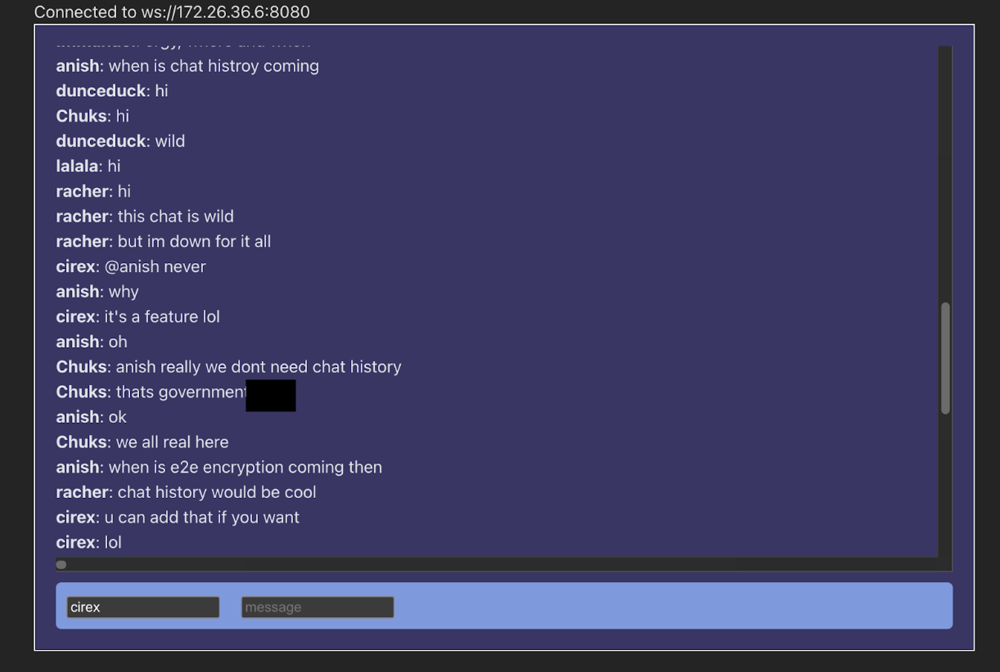
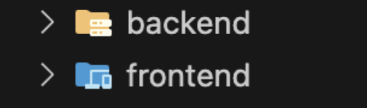
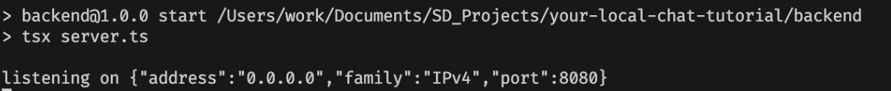
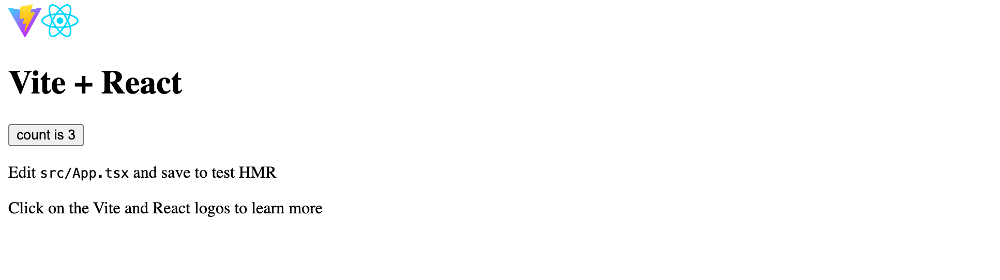
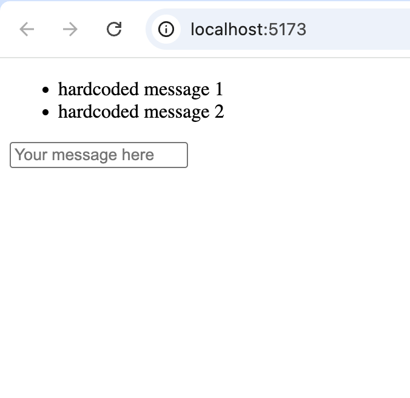
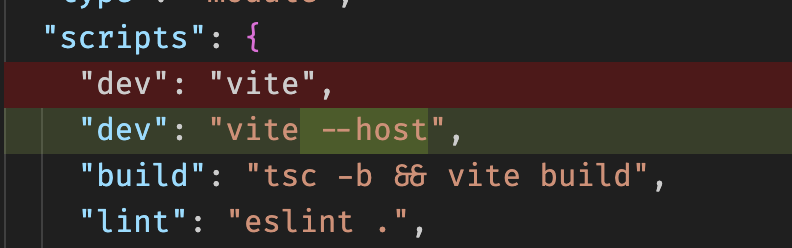

## Build a Local Area Network (LAN) chat with React and Typescript!

> [!NOTE]
> You do NOT need to clone this repo! The code here is only for reference in case you get stuck. The instructions also contain a reference solution at the end of every section.

We'll be building a bare-bones version of the chat app seen below, hosted on your very own computer. What's special about this app is that it can only be accessed by users connected to the same wifi network that you're connected to.



# Table of contents

- [Overview](#overview)
- [Backend](#writing-the-backend)
- [Frontend (UI)](#writing-the-frontend-ui-no-styles-just-basic-elements)
- [Frontend (interactivity)](#making-the-frontend-interactive)
- [Deploying The App](#deploying-the-app)

## Overview

You'll be writing a LAN (Local Access Network) anonymous chat app from scratch! At a high level, both the backend and frontend will be hosted under your private network. Users can chat through the frontend interface when on the same network. (Think: Minecraft LAN servers) Client messages are sent to the backend through a websocket, which is then responsible for relaying the message to all active websocket connections. The frontend will be built with React and Typescript, and the backend will be Typescript. (JavaScript can also be used if preferred, but you may need to deviate from the instructions slightly)

## Prerequisites

Ensure you have Node.js installed on your device. (run `npm -v` to check)
Familiarity with React and Typescript is recommended.

## Getting started

1. Create an empty directory with these two folders: (source control (ex. with `git`) is recommended but not required.)

   

## Writing the backend

1.  `cd` into the backend folder and run `npm init -y`, which creates a `package.json` file
1.  Run `npm i socket.io tsx` to install socket.io (for our websocket initialization) and tsx (to start up the server). If this was successful, a `node_modules` folder will be created.
1.  Create a file called `server.ts` (or with any other name, as long as it ends in `.ts`) inside the `backend` folder. Let's set up our websocket server now! Start with these imports:

    ```ts
    import http from "http";
    import { Server } from "socket.io";
    ```

1.  Let's initialize the http server and websocket

    ```ts
    const httpServer = http.createServer();
    const io = new Server(httpServer, { cors: { origin: "*" } });
    ```

> [!TIP]
> It's good practice to use `const` when declaring variables in `js` or `ts` that won't be re-assigned.

5.  Using the `io` websocket server instance, we'll now add the feature to send and receive messages from clients. Here are some hints:

    - To listen to a websocket connection, we can call `io.on("connect",(socket)=>{})` where the second argument is a callback that takes in the newly created connection.

    - Using this `socket`, we can run `socket.on("message",(payload)=>{})` to receive messages
    - `io.emit("message", payload)` will send the payload to all subscribers.

> [!NOTE]
> Note that payload can be any type, even a JS object! (just make sure to re-use the same type for the frontend)

6.  Let's mount the server on port 8080 as follows. (`0.0.0.0` means the backend will bind to all available IP addresses assigned to your device (usually that's just one ipv4 address).)
    ```ts
    httpServer.listen(8080, "0.0.0.0", () =>
      console.log("listening on " + JSON.stringify(httpServer.address()))
    );
    ```
7.  To run the server, we’ll add a `start` command script with the value `tsx server.ts` to `package.json`.
    ```diff
    + "scripts": { "start": "tsx server.ts" }
    ```
8.  We can now run the server by running `npm run start` in the terminal. If everything works, we should get an output similar to the following:
    

To restart the server, type `ctrl-c` or `ctrl-d` in the terminal and run `npm run start` again. Our backend is now ready to handle clients!

<details>
     <summary>See here for a reference solution</summary>

```ts
import http from "http";
import { Server } from "socket.io";

const httpServer = http.createServer();
const io = new Server(httpServer, { cors: { origin: "*" } });

io.on("connect", (socket) => {
  socket.on("message", (payload) => {
    io.emit("message", payload);
  });
});
httpServer.listen(8080, "0.0.0.0", () =>
  console.log("listening on " + JSON.stringify(httpServer.address()))
);
```

</details>

## Writing the frontend UI (no styles, just basic elements)

1. We’ll be using `vite` to bootstrap our frontend React application. `cd` into `frontend` and run `npm create vite@latest .` Select React and TypeScript when prompted.

1. Run `npm install` to install vite, react, and several linting libraries.

> [!NOTE]
> Curious about the full list of packages installed? Check out the dependencies in `package.json`.

3. We'll need a couple basic elements. To make our lives easier, let's delete everything in `index.css` and `App.css`. Our code will live in `App.tsx` for the most part.

> [!NOTE]
> To be more specific, we're building a client-side single page web app, or SPA for short.

4. Run `npm run dev` to see the output. We should see something like this:

   

> [!TIP]
> Vite (the framework we're using) supports hot reload, meaning that we don't need to restart the server in order to see our frontend changes. Make a change and save to see this in action!

5. In `App.tsx`, add a state for the entire list of chat messages, render that state, and add a `<form>` with an `<input>` box so that the user can send messages. It should look something like this: (Don't worry about making it interactive just yet.)



> [!NOTE]
> The function `App` in `App.tsx` is called a React (functional) component. (The only distinction between components and regular functions is that components start with a capital letter.) For a primer on handling state in components, see [here](https://react.dev/reference/react/useState#usage). Also note that in typescript, `useState` allows us to pass in an additional type argument using angle brackets so that the state is typed correctly. For example, `const [array, setArray] = useState<string[]>([])` allows typescript to infer that `array` is of type `string[]`.

<details>
     <summary>See here for a reference solution</summary>

```ts
import { useState } from "react";
import "./App.css";

function App() {
  const [messages, setMessages] = useState<string[]>(["hi", "bye"]);
  return (
    <>
      <ul>
        {messages.map((message) => (
          <li>{message}</li>
        ))}
      </ul>
      <form>
        <input type="text" placeholder="Your message here" />
      </form>
    </>
  );
}
export default App;
```

</details>

## Making the frontend interactive

1. Great! We’ll now need to initialize our websocket connection and handle sending and receiving messages, both on the frontend. To start, run `npm install socket.io-client` in the `frontend` folder.
1. Since we only need one global `socket` state, let's add these two lines outside of the `App` component. (We're working in `App.tsx`).

   ```ts
   import { io } from "socket.io-client";
   const socket = io("http://localhost:8080");
   ```

> [!CAUTION]
> To allow other people to log on to the chat app on their devices, be sure to replace `localhost` with your actual IP address. See the `Deploying The App` section for more details.

3. To receive socket messages, use the `socket.on("message", onMessage);` to subscribe and `socket.off("message", onMessage);` to unsubscribe. (where `onMessage` is a callback function that gets invoked with the message as its first argument when the backend emits a message). Since we want to subscribe on component mount, let's do so in a `useEffect` with an empty dependency array inside the `App` component. See React's [useEffect documentation](https://react.dev/reference/react/useEffect) for more details.

1. Once we received a message, we'll need to update the message state to trigger a component re-render. As a hint, `setXXX()` can also accept a callback function where the input is the previous state and the returned value is the new state, which can possibly incorporate the previous state in it.
1. To handle form submissions, make sure the input box is wrapped in a `form` component. We'll then add something like the following to grab the input message when form submission is triggered:

   ```jsx
   <form
        onSubmit={(ev) => {
          ev.preventDefault();
          const formData = new FormData(ev.target as HTMLFormElement);
          socket.emit("message", formData.get("message"));
          // "message" is the name attribute for the input element
          // (we'll need to set the "name" attribute on the input
          // element manually)
        }}
      >
   ```

> [!IMPORTANT]
> We're wrapping our `<input>` in a form for a better user experience and more semantic HTML. Sure, we can also just make a `<input>` element with a submit button to the right of it, but then we'll need a separate event listener for the `Enter` keypress. And what about screen-reader interaction? The `<form>` element handles all of that.

6. Now, assuming our backend is running, we should have something like the following!

<details>
     <summary>See here for a reference solution</summary>

```ts
import { useEffect, useState } from "react";
import "./App.css";
import { io } from "socket.io-client";
const socket = io(`${window.location.hostname}:8080`);

function App() {
  const [messages, setMessages] = useState<string[]>(["hi", "bye"]);
  useEffect(() => {
    const onMessage = (payload: string) => {
      setMessages((messages) => [...messages, payload]);
    };
    socket.on("message", onMessage);
    return () => {
      socket.off("message", onMessage);
    };
  }, []);
  return (
    <>
      <ul>
        {messages.map((message) => (
          <li>{message}</li>
        ))}
      </ul>
      <form
        onSubmit={(ev) => {
          ev.preventDefault();
          const formData = new FormData(ev.target as HTMLFormElement);
          socket.emit("message", formData.get("message"));
        }}
      >
        <input type="text" placeholder="Your message here" name="message" />
      </form>
    </>
  );
}

export default App;
```

</details>

https://github.com/user-attachments/assets/1c084a11-5991-40cc-aa14-fdbc98c91a13

## Deploying the app!

1. For the frontend, make the following change in `package.json` and then restart the server.
   
1. Change the frontend WebSocket address to point to the same IP as the frontend URL (we can also dynamically set it with `window.location.hostname`)
1. Now, copy the frontend link containing your IP (not the localhost one) to share the chat app with your friends!

## Bonus quality-of-life tweaks

Have some extra time? Here are some additional feature ideas that build upon what we've just covered. The majority of these are implemented in the reference solution in this repo.

- Clear the message input once the user sends a message
- Add a state/indicator for whether or not the websocket connection is active.
- Style the site with CSS to be more user-friendly
- Scroll to bottom on new message
- Allow users to put in a username
  - Put the message in its own div so users can copy-paste the message without copying the username

## Bonus nontrivial features

- E2E encryption
- Save messages
- Indicator for the number of people online
- Notification when someone joins or leaves the chat
- Chat rooms
